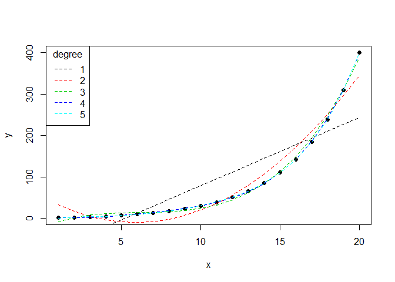

Compare the fit of multiple polynomal regressions
================
David Kaiser
2018-09-20

Description
-----------

This function fits multiple polynomal regressions to x and y data. The user supplies the highest degree of polynomal that should be included and all polynomals from one to that degree will be calculated. A summary table will be output. ANOVA is performed on consecutive polynomal regressions (e.g. cubic vs quadratic fit) to indicate which increase in polynomal degree still produces a significant reduction in residual sum of squares.

Arguments
---------

-   *x* - a vector of x values
-   *y* - a vector of y values
-   *degrees* - numeric value for the highest degree polynomal
-   *plot* - logical, should the results be plotted? defaults to TRUE

Result
------

A data frame giving for each polynomal R², the adjusted R², f-statistic value and the p-value of the regression, as well as the Residual Sum of Squares and the ANOVA p-value. A plot showing the data and the different fits (if plot = TRUE).

Example
-------

``` r
x <- seq(1,20,length.out = 20)
y <- x^seq(1,2,length.out = 20)
compare_model_fits(x, y, degrees = 5)
```



    ##   degree r.squared adj.r.squared f.statistic regression.P        RSS
    ## 1      1 0.7332036     0.7183815    49.46717 1.457740e-06 177.419625
    ## 2      2 0.8964548     0.8842730    73.58977 4.252105e-09  68.857543
    ## 3      3 0.9542187     0.9456347   111.16260 6.309989e-11  30.444554
    ## 4      4 0.9787035     0.9730244   172.33535 2.418192e-12  14.162166
    ## 5      5 0.9899925     0.9864185   276.99135 1.766376e-13   6.654959
    ##        anova.P
    ## 1           NA
    ## 2 4.611020e-10
    ## 3 3.436916e-07
    ## 4 4.199734e-05
    ## 5 1.384857e-03
